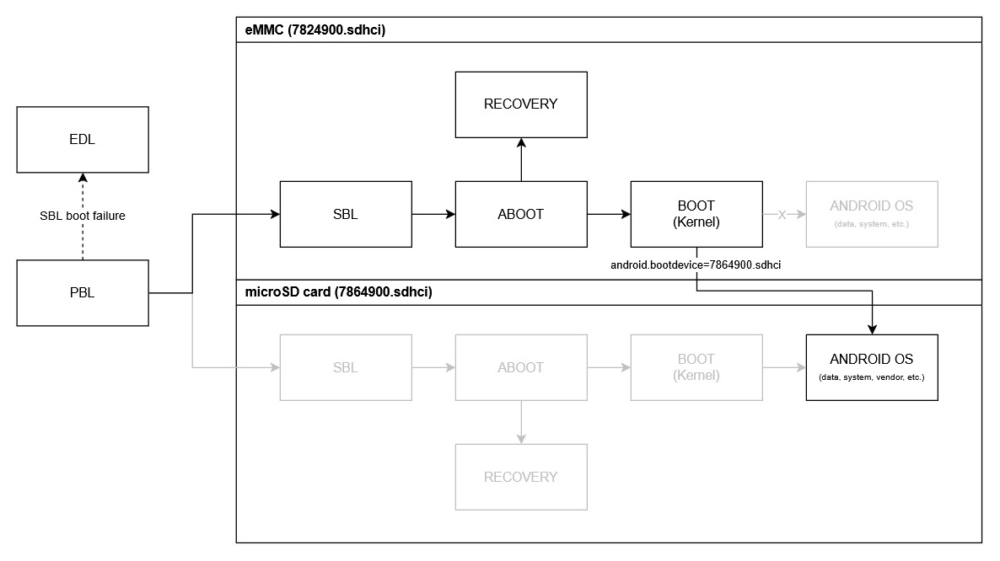
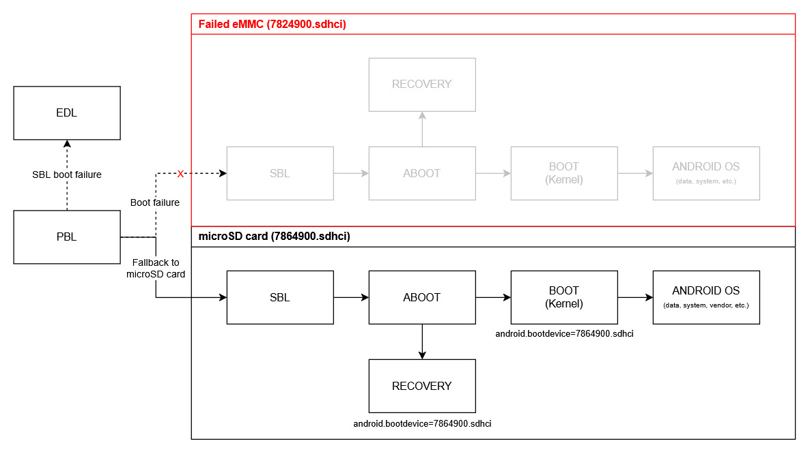

# ProjectProto for selected Samsung Galaxy MSM8916 devices

ProjectProto is an eMMC cloner and microSD repartitioner for selected Samsung Galaxy MSM8916 devices. It prepares supported devices to boot an Android OS from the microSD card.

## Why ProjectProto?

On Samsung MSM8916 devices it is not possible to modify the partition table on the internal (eMMC) storage, regardless of the tool or method used. Whether attempting to delete, create, or modify partitions, tools will not report any errors and will appear to succeed but no actual changes will be made. In some cases even the contents of certain partitions cannot be modified, leaving users with limited options for customization.

The partitions that can be modified on these devices, such as userdata, system, cache, boot, recovery and even efs, allow changes to their contents but the partitions themselves cannot be resized, deleted, or recreated. This limitation remains persistent even with advanced tools like `dd` and `sgdisk`. The root cause of this behavior is unclear but it is believed to be a combination of Qualcomm's and Samsung's proprietary security and protection mechanisms.

### Why is this an issue?

For users and developers who want to perform more advanced customization on their devices these limitations can be very frustrating. The inability to modify the partition table directly on the eMMC restricts the flexibility of the device, especially for tasks such as:

- Expanding partition sizes to accommodate larger, more modern versions of Android OS.
- Repartitioning to enable Android Treble support, which requires a dedicated vendor partition.

### How does ProjectProto solve this problem?

ProjectProto clones the entire eMMC storage (including all existing partitions) to the microSD card using the `dd` utility. After cloning, the system, cache, hidden, and userdata partitions on the microSD card will be removed and recreated using `sgdisk` and `blockdev` to adjust the partition layout. The protection mechanisms on eMMC do not apply to microSD cards which allows the partition layout on the microSD card to be modified freely.

> [!NOTE]
> Only partitions are being cloned. Hardware-bound blocks e.g. Replay Protected Memory (`/dev/block/mmcblk0rpmb`) cannot be cloned.

### Partition layout changes on the microSD card

- The system partition will be resized to 3.5 GiB.
- The cache and hidden partitions will retain their original sizes. Repartitioning is required because the system partition precedes them and will be expanded.
- A new vendor partition with a size of 700 MiB will be created. To preserve the original partition order, the vendor partition is placed after the userdata partition.
- All remaining available sectors will be assigned to the userdata partition.

This repartitioning allows the installation of larger, especially 64-bit based Android OS. The addition of a dedicated vendor partition also prepares the device for Android Treble compatibility.

## Requirements

- TWRP Recovery with the following tools included: `dd`, `sgdisk`, `blockdev`, `awk`, `mke2fs`
- A fully functional microSD card slot
- A microSD card of 16 GB or larger, providing enough space to hold the entire eMMC storage

Recommended: At least a 32 GB microSD card with Class 10, UHS-I (U3), V30, A2, or better specifications.

> [!IMPORTANT]
> The performance of the microSD card directly affects ROM performance. Cards slower than the recommended specifications may result in poor ROM performance and a bad user experience.

## Installation
To preserve the modularity of ProjectProto, a single monolithic shell script was avoided. Instead the core operations were split into multiple shell script files. This approach ensures compatibility not only with shell-based installation scripts but also with (Aroma) updater scripts used in TWRP Recovery.

### Flashable
W.I.P.

### Manual

1. Boot into TWRP Recovery
2. Create a new directory `scripts` in `/tmp`:
```shell
mkdir -p /tmp/scripts
```
3. Copy all shell script files from this repository to `/tmp/scripts` on your Samsung MSM8916 device
4. Set the required permissions:
```shell
chmod 0755 /tmp/scripts/*
```
5. Run the installer:
```shell
sh /tmp/scripts/install.sh
```
---
> [!IMPORTANT]
> - The installation speed depends on the specifications of the microSD card.
> - Do <b>not</b> remove the microSD card during installation!

## Booting from microSD card

The boot process depends on whether the device has a functional eMMC. If this is the case, the MSM8916 will always boot from the eMMC, regardless of whether ProjectProto is installed. To boot the Android OS from the microSD card, the kernel command line parameter `android.bootdevice` in the kernel image must be changed from `7824900.sdhci` to `7864900.sdhci`. This will lead the kernel to mount all partitions using `/dev/block/bootdevice/*` from the microSD card instead of the eMMC. If the kernel's device tree includes an Android fstab (e.g. for early mounting), the corresponding SDHCI paths must also be updated there.

With these changes applied, the boot process proceeds as follows:



> [!WARNING]
> It is also important to remove the microSD card from the Android fstab, as otherwise the Android ramdisk may attempt to mount the first partition (APNHLOS) as external storage, incorrectly treating it as usable storage.

### Boot process with a corrupted or failed eMMC

If the eMMC becomes corrupted or fails for any reason, the MSM8916 may attempt to boot from the microSD card instead. Since ProjectProto clones all eMMC partitions to the microSD card, the MSM8916 can load the Secondary Bootloader (SBL) and the Android Bootloader (ABOOT) from the microSD card even if the eMMC has failed:



This means that ProjectProto may prevent a complete device failure that would otherwise leave the device stuck in EDL mode (QDLoader 9008). However, it is not guaranteed that the Primary Bootloader (PBL) will fall back to the microSD card, as this highly depends on the boot configuration implemented in the PBL.

Therefore, ROM developers are advised to install the kernel image on both the eMMC and the microSD boot partitions. This ensures that the ROM remains bootable from the microSD card in case the PBL falls back to it during the boot process.

## Supported devices

The following devices are supported by ProjectProto:

- <b>Galaxy A3 2015</b>: SM-A300FU, SM-A300Y
- <b>Galaxy Ace 4</b>: SM-G357FZ
- <b>Galaxy J5 2015</b>: SM-J500F, SM-J500FN, SM-J500G, SM-J500H, SM-J500M, SM-J500N0, SM-J500Y
- <b>Galaxy J5 2016</b>: SM-J510F, SM-J510FN, SM-J510FQ, SM-J510GN, SM-J510H, SM-J510K, SM-J510L, SM-J510MN, SM-J510S, SM-J510UN

## License

ProjectProto is licensed under the MIT License
